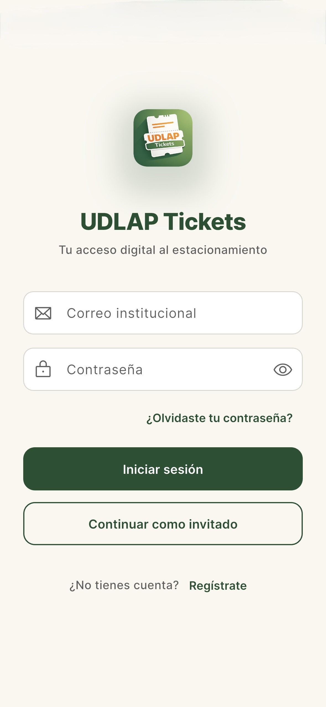
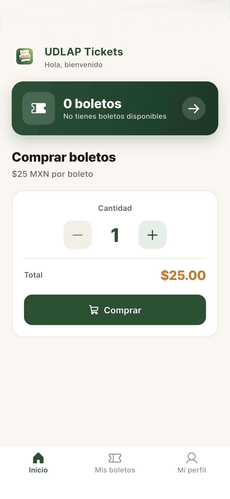
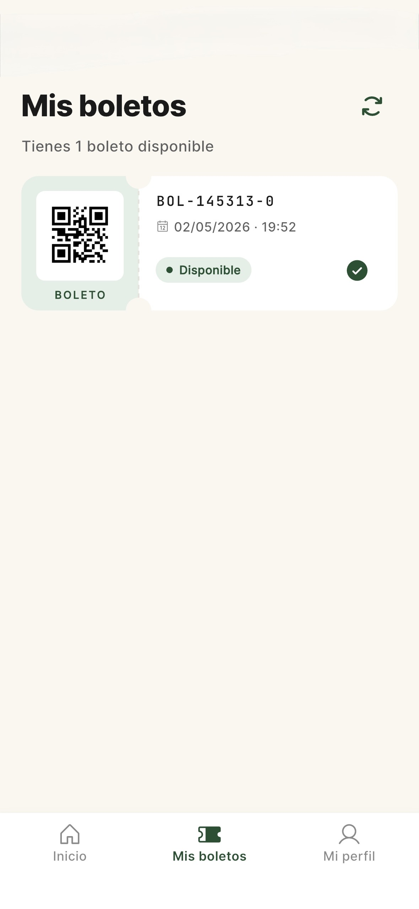
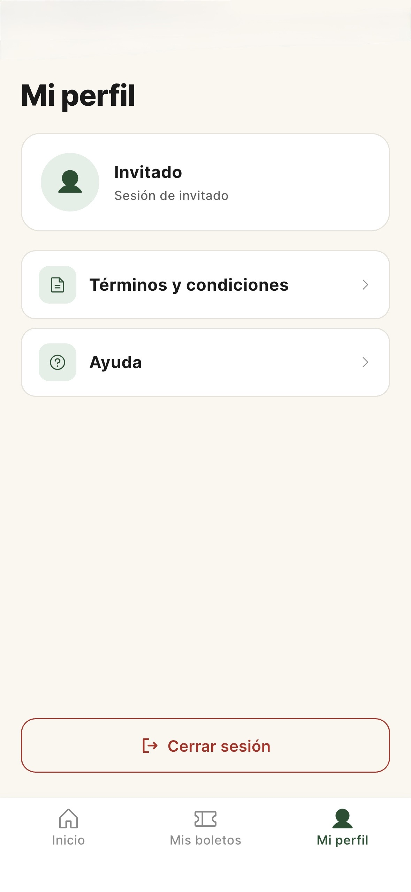

<div align="center">


<br><br>

<a href="README.md"></a>
&nbsp;
<a href="#"></a>

</div>

---

<div align="center">


<br>

# UDLAP Tickets

**Digital ticketing system for university parking**

<br>

[](https://flutter.dev)
[](https://dart.dev)
[](https://www.djangoproject.com)
[](https://m3.material.io)

[](#)
[](#)
[](#)
[](LICENSE)
[](#)

</div>

---

## 📋 Table of Contents

- [About the Project](#-about-the-project)
- [Features](#-features)
- [Architecture](#-architecture)
- [Getting Started](#-getting-started)
  - [Prerequisites](#prerequisites)
  - [Backend Setup](#backend-setup)
  - [App Setup](#app-setup)
- [Project Structure](#-project-structure)
- [REST API](#-rest-api)
- [App Flow](#-app-flow)
- [Team](#-team)
- [License](#-license)

---

## 🎯 About the Project

**UDLAP Tickets** is a full-stack platform that modernizes the parking access system at Universidad de las Américas Puebla. The solution combines a Flutter mobile app with a Django REST Framework backend so students and university staff can purchase and manage digital parking tickets quickly, securely, and without the need for physical tickets.

### Why UDLAP Tickets?

| Problem | Solution |
|---------|----------|
| Long lines at toll booths | Buy ahead from your phone |
| Physical tickets that get lost | Digital tickets always available |
| No flexible payment options | Pay with card or rechargeable balance |
| No purchase history | Full transaction history |
| Slow validation at the gate | QR codes scannable on the spot |

---

## ✨ Features

<table>
<tr>
<td width="50%">

### 🔐 Authentication
- Login with institutional email
- New user registration
- Password recovery with verification code
- Persistent session with auto-login

</td>
<td width="50%">

### 🎫 Ticket Management
- Buy tickets with balance deduction
- View active and used tickets
- QR code generated per ticket
- Purchase and consumption history

</td>
</tr>
<tr>
<td width="50%">

### 💳 Payment Methods
- Credit/debit card payment
- Rechargeable balance payment
- Balance top-up via barcode

</td>
<td width="50%">

### 👤 User Profile
- Personal information
- Real-time available balance
- Activity notifications
- Secure logout

</td>
</tr>
</table>

---

## 📱 Screenshots

<div align="center">

<table>
<tr>
<td align="center" width="25%">
  <br>
  <sub><b>Sign in</b></sub><br>
  <sub>Institutional access or guest mode</sub>
</td>
<td align="center" width="25%">
  <br>
  <sub><b>Home</b></sub><br>
  <sub>Quick purchase from the home tab</sub>
</td>
<td align="center" width="25%">
  <br>
  <sub><b>My tickets</b></sub><br>
  <sub>Scannable QR codes</sub>
</td>
<td align="center" width="25%">
  <br>
  <sub><b>My profile</b></sub><br>
  <sub>Account, help and terms</sub>
</td>
</tr>
</table>

</div>

---

## 🏗 Architecture

The platform is split into two components that live in this monorepo:

```
┌──────────────────────────┐         HTTPS / JSON         ┌──────────────────────────┐
│                          │ ◀─────────────────────────▶  │                          │
│   Flutter App            │   Token Authentication       │   Django REST Backend    │
│   (Android / iOS / Web)  │                              │   (api_tickets)          │
│                          │                              │                          │
└──────────────────────────┘                              └────────────┬─────────────┘
                                                                       │
                                                                       ▼
                                                          ┌──────────────────────────┐
                                                          │   SQLite (development)   │
                                                          │   PostgreSQL (production)│
                                                          └──────────────────────────┘
```

- **Frontend (Flutter):** screen-based architecture with `Navigator` and a singleton `ApiService` to talk to the backend. Local persistence via `shared_preferences`.
- **Backend (Django):** REST API with Token Authentication, `Boleto` and `PerfilUsuario` models, and endpoints for registration, login, password recovery, and ticket purchase/consumption.
- **Configuration:** sensitive values (`SECRET_KEY`, `DEBUG`, `ALLOWED_HOSTS`, CORS) are read from environment variables; see `.env.example`.

---

## 🚀 Getting Started

### Prerequisites

| Tool | Minimum Version | Installation |
|------|-----------------|--------------|
| Flutter SDK | 3.10+ | [flutter.dev/get-started](https://docs.flutter.dev/get-started/install) |
| Dart SDK | 3.10.4+ | Included with Flutter |
| Python | 3.10+ | [python.org/downloads](https://www.python.org/downloads/) |
| Android Studio / Xcode | Latest stable | [developer.android.com](https://developer.android.com/studio) |

> **Tip:** Verify your Flutter setup by running `flutter doctor`.

### Backend Setup

```bash
# 1. Clone the repository
git clone https://github.com/Robbienicur/UDLAP-Tickets.git
cd UDLAP-Tickets

# 2. Create and activate a virtual environment
python -m venv venv
source venv/bin/activate          # macOS / Linux
# venv\Scripts\activate           # Windows

# 3. Install dependencies
pip install django djangorestframework django-cors-headers

# 4. Configure environment variables
cp .env.example .env              # edit values per environment

# 5. Apply migrations
python manage.py makemigrations
python manage.py migrate

# 6. Start the server on port 8001
python manage.py runserver 8001
```

> **Important:** the Flutter client expects the backend on port **8001** by default. To change it, pass `--dart-define=API_BASE_URL=...` when running the app.

### App Setup

```bash
# From the repo root
flutter pub get

# Run in debug mode
flutter run

# Point to a specific backend
flutter run --dart-define=API_BASE_URL=http://192.168.1.10:8001/api
```

<details>
<summary><strong>🔧 Additional useful commands</strong></summary>

```bash
# Analyze Flutter code
flutter analyze

# Run tests
flutter test

# Build release APK
flutter build apk --release

# Build for iOS
flutter build ios --release

# Validate Django configuration
python manage.py check
```

</details>

---

## 📁 Project Structure

```
UDLAP-Tickets/
├── 📂 api_tickets/              # Django app with business logic
│   ├── models.py                # Boleto, PerfilUsuario
│   ├── views.py                 # REST endpoints
│   ├── urls.py                  # API routes
│   └── serializers.py
├── 📂 backend_tickets/          # Django project configuration
│   ├── settings.py              # Reads environment variables
│   ├── urls.py
│   └── wsgi.py
├── 📂 lib/                      # Flutter source code
│   ├── 📄 main.dart             # Entry point
│   ├── 📂 models/               # Data models (Boleto)
│   ├── 📂 screens/              # Application screens
│   │   ├── auth/                # Login, register, recovery
│   │   ├── home/                # Main screen and notifications
│   │   └── tickets/             # Balance, history, top-up
│   ├── 📂 services/             # ApiService (HTTP client)
│   └── 📂 theme/                # UDLAP palette and typography
├── 📂 android/ ios/ web/        # Native configuration per platform
├── 📂 test/                     # Widget tests
├── 📄 manage.py                 # Django entry point
├── 📄 .env.example              # Environment variable template
├── 📄 pubspec.yaml              # Flutter dependencies
└── 📄 README.md
```

---

## 🌐 REST API

Development base URL: `http://localhost:8001/api`

| Method | Endpoint | Description | Auth |
|--------|----------|-------------|------|
| `POST` | `/auth/register/` | Create a new account | No |
| `POST` | `/auth/login/` | Sign in and obtain token | No |
| `POST` | `/auth/request-reset/` | Request a password recovery code | No |
| `POST` | `/auth/reset-password/` | Confirm a new password with the code | No |
| `GET` | `/boletos/` | List the user's tickets | Yes |
| `POST` | `/boletos/comprar/` | Buy tickets (deducts balance) | Yes |
| `POST` | `/boletos/consumir/` | Mark a ticket as used | Yes |

Authentication uses the `Authorization: Token <key>` header. The recovery code expires after 10 minutes.

---

## 🔄 App Flow

```
┌─────────────┐     ┌──────────────┐     ┌──────────────────┐
│   Login /   │────▶│    Home      │────▶│    Purchase      │
│  Register   │     │  (Tickets)   │     │   Confirmation   │
└─────────────┘     └──────────────┘     └──────────────────┘
                            │                     │
                            ▼                     │
                    ┌──────────────┐              │
                    │  My Tickets  │              │
                    │  (QR + use)  │              │
                    └──────────────┘              │
                                                  │
                          ┌───────────────────────┼───────────────────┐
                          ▼                       ▼                   ▼
                   ┌─────────────┐      ┌──────────────┐    ┌──────────────┐
                   │  Card       │      │  Balance     │    │    Other     │
                   │  Payment    │      │  Payment     │    │   Methods    │
                   └─────────────┘      └──────────────┘    └──────────────┘
                                               │
                                               ▼
                                        ┌─────────────┐
                                        │   Top-up    │
                                        │   Balance   │
                                        └─────────────┘
```

---

## 👥 Team

<div align="center">

Project developed for the **Software Engineering** course — UDLAP

The team follows the **Scrum** framework, organizing development in Sprints with incremental deliveries.

| Member | Scrum Role |
|:------:|:----------:|
| **Robbie Nicolas Curioso de Salazar** | Product Owner |
| **Héctor Jesús Núñez Tecpanecatl** | Scrum Master |
| **José Luis Godínez Carillo** | Developer |
| **Sebastián Torres Morales** | Developer |
| **Ricardo Carballido Rosas** | Developer |

</div>

---

## 📄 License

This project is **open source**. Anyone is free to clone, modify, and contribute to the development of the application.

Distributed under the MIT License. See the [`LICENSE`](LICENSE) file for more information.

---

<div align="center">

[](https://github.com/Robbienicur/UDLAP-Tickets)

UDLAP · Puebla, Mexico

</div>
