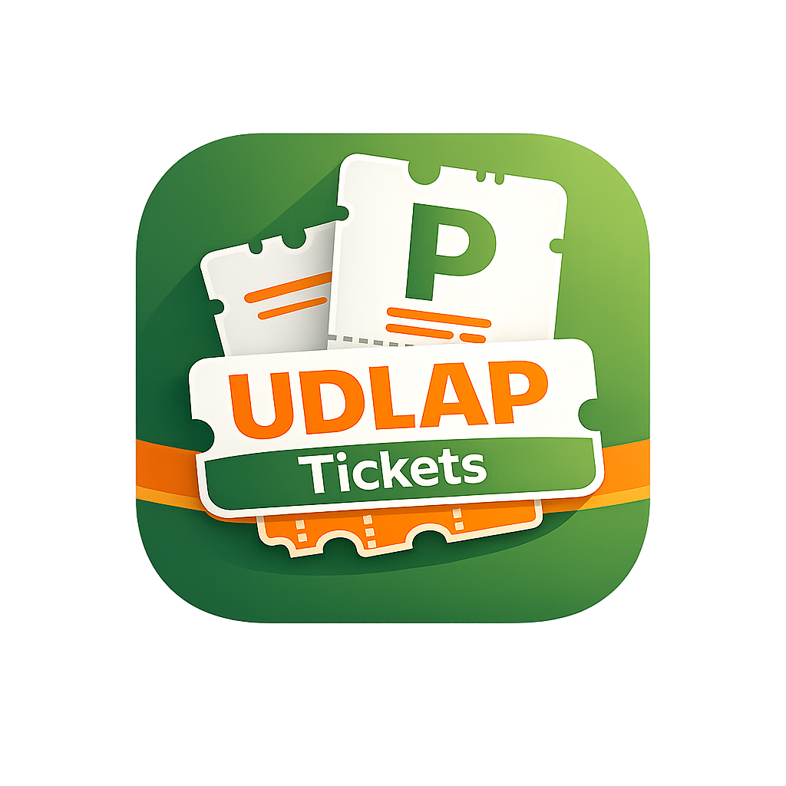

<div align="center">

<!-- Language Toggle -->
[](#)
[](README.en.md)

<!-- Logos -->

<br><br>


# UDLAP Tickets

**Sistema de boletos digitales para el estacionamiento universitario**

---

<!-- Badges -->
[](https://flutter.dev)
[](https://dart.dev)
[](https://m3.material.io)

[](#)
[](#)
[](#)
[](LICENSE)
[](#)

</div>

---

## 📋 Tabla de Contenidos

- [Acerca del Proyecto](#-acerca-del-proyecto)
- [Funcionalidades](#-funcionalidades)
- [Arquitectura](#-arquitectura)
- [Comenzar](#-comenzar)
  - [Requisitos Previos](#requisitos-previos)
  - [Instalación](#instalación)
  - [Ejecución](#ejecución)
- [Estructura del Proyecto](#-estructura-del-proyecto)
- [Flujo de la Aplicación](#-flujo-de-la-aplicación)
- [Equipo](#-equipo)
- [Licencia](#-licencia)

---

## 🎯 Acerca del Proyecto

**UDLAP Tickets** es una aplicación móvil desarrollada en Flutter que moderniza el sistema de acceso al estacionamiento de la Universidad de las Américas Puebla. La app permite a estudiantes y personal universitario comprar y gestionar boletos digitales de forma rápida, segura y sin necesidad de boletos físicos.

### ¿Por qué UDLAP Tickets?

| Problema | Solución |
|----------|----------|
| Filas largas en casetas de cobro | Compra anticipada desde el celular |
| Boletos físicos que se pierden | Boletos digitales siempre disponibles |
| Sin opciones de pago flexible | Pago con tarjeta o saldo recargable |
| No hay control de historial | Historial completo de compras |

---

## ✨ Funcionalidades

<table>
<tr>
<td width="50%">

### 🔐 Autenticación
- Inicio de sesión con correo institucional
- Registro de nuevos usuarios
- Acceso como invitado

</td>
<td width="50%">

### 🎫 Gestión de Boletos
- Selección de cantidad de boletos
- Visualización de boletos activos
- Historial de compras

</td>
</tr>
<tr>
<td width="50%">

### 💳 Métodos de Pago
- Pago con tarjeta de crédito/débito
- Pago con saldo recargable
- Recarga de saldo mediante código de barras

</td>
<td width="50%">

### 👤 Perfil de Usuario
- Información personal
- Saldo disponible en tiempo real
- Gestión de cuenta

</td>
</tr>
</table>

---

## 🏗 Arquitectura

La aplicación sigue una arquitectura basada en **pantallas** (screens) con navegación imperativa utilizando `Navigator`:

```
lib/
├── main.dart                          # Punto de entrada
└── screens/
    ├── login_screen.dart              # Inicio de sesión
    ├── registro_screen.dart           # Registro de usuario
    ├── home_screen.dart               # Pantalla principal con navegación
    ├── confirmacion_screen.dart       # Confirmación de compra
    ├── pago_tarjeta_screen.dart       # Formulario de pago con tarjeta
    ├── saldo_screen.dart              # Pantalla de saldo
    └── recargar_saldo_screen.dart     # Recarga de saldo (código de barras)
```

---

## 🚀 Comenzar

### Requisitos Previos

Asegúrate de tener instalado lo siguiente:

| Herramienta | Versión Mínima | Instalación |
|-------------|---------------|-------------|
| Flutter SDK | 3.10+ | [flutter.dev/get-started](https://docs.flutter.dev/get-started/install) |
| Dart SDK | 3.10.4+ | Incluido con Flutter |
| Android Studio / Xcode | Última estable | [developer.android.com](https://developer.android.com/studio) / App Store |

> **Tip:** Verifica tu instalación ejecutando `flutter doctor` en la terminal.

### Instalación

```bash
# 1. Clonar el repositorio
git clone https://github.com/Robbienicur/UDLAP-Tickets.git

# 2. Entrar al directorio del proyecto
cd UDLAP-Tickets

# 3. Instalar dependencias
flutter pub get
```

### Ejecución

```bash
# Ejecutar en modo debug
flutter run

# Ejecutar en un dispositivo específico
flutter run -d chrome      # Web
flutter run -d android     # Android
flutter run -d ios         # iOS
```

<details>
<summary><strong>🔧 Comandos útiles adicionales</strong></summary>

```bash
# Analizar el código
flutter analyze

# Ejecutar tests
flutter test

# Construir APK de release
flutter build apk --release

# Construir para iOS
flutter build ios --release
```

</details>

---

## 📁 Estructura del Proyecto

```
UDLAP-Tickets/
├── 📂 android/               # Configuración nativa Android
├── 📂 ios/                    # Configuración nativa iOS
├── 📂 lib/                    # Código fuente principal
│   ├── 📄 main.dart           # Punto de entrada de la aplicación
│   └── 📂 screens/            # Pantallas de la aplicación
├── 📂 linux/                  # Soporte para Linux
├── 📂 macos/                  # Soporte para macOS
├── 📂 web/                    # Soporte para Web
├── 📂 windows/                # Soporte para Windows
├── 📂 test/                   # Tests unitarios y de widgets
├── 📄 pubspec.yaml            # Dependencias y configuración
├── 📄 analysis_options.yaml   # Reglas de análisis de código
└── 📄 README.md               # Este archivo
```

---

## 🔄 Flujo de la Aplicación

```
┌─────────────┐     ┌──────────────┐     ┌──────────────────┐
│   Login /   │────▶│    Home      │────▶│  Confirmación    │
│  Registro   │     │  (Boletos)   │     │   de Compra      │
└─────────────┘     └──────────────┘     └──────────────────┘
                                                  │
                          ┌───────────────────────┼───────────────────┐
                          ▼                       ▼                   ▼
                   ┌─────────────┐      ┌──────────────┐    ┌──────────────┐
                   │   Pago con  │      │  Pago con    │    │    Otros     │
                   │   Tarjeta   │      │    Saldo     │    │   Métodos    │
                   └─────────────┘      └──────────────┘    └──────────────┘
                                               │
                                               ▼
                                        ┌─────────────┐
                                        │  Recargar   │
                                        │    Saldo    │
                                        └─────────────┘
```

---

## 👥 Equipo

<div align="center">

Proyecto desarrollado para la materia de **Ingeniería de Software** — UDLAP

| Integrante | Rol |
|:----------:|:---:|
| **Robbie Nicolas Curioso de Salazar** | Desarrollador |
| **José Luis Godínez Carillo** | Desarrollador |
| **Héctor Jesús Núñez Tecpanecatl** | Desarrollador |
| **Sebastián Torres Morales** | Desarrollador |
| **Ricardo Carballido Rosas** | Desarrollador |

</div>

---

## 📄 Licencia

Este proyecto es **open source**. Cualquier persona es libre de clonar, modificar y contribuir al desarrollo de la aplicación.

Distribuido bajo la Licencia MIT. Consulta el archivo [`LICENSE`](LICENSE) para más información.

---

<div align="center">

[](https://github.com/Robbienicur/UDLAP-Tickets)

UDLAP · Puebla, México

</div>
